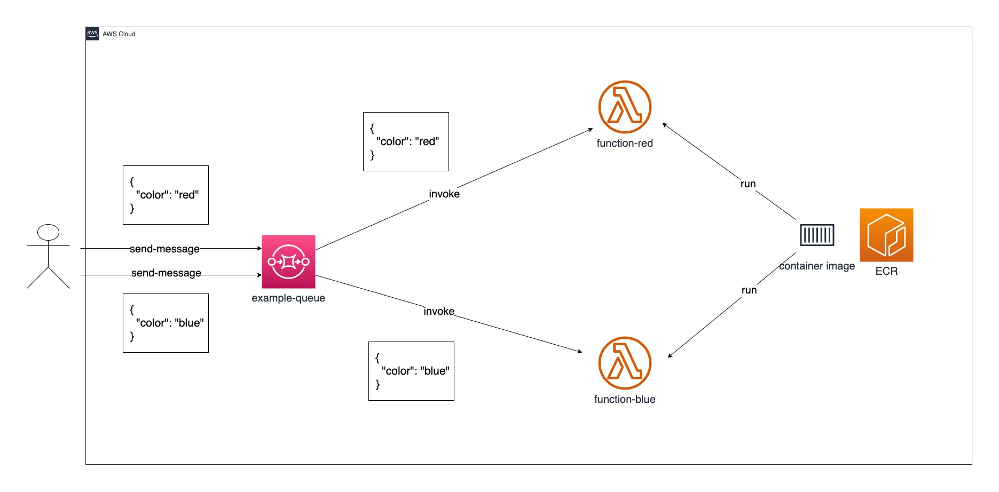

sqs-lambda-example
===

Example of AWS Lambda functions that invoked by message from Amazon SQS.

The following architecture will be built.

# License

[MIT](https://github.com/michimani/sqs-lambda-example/blob/main/LICENSE)

# Author

[michimani210](https://twitter.com/michimani210)